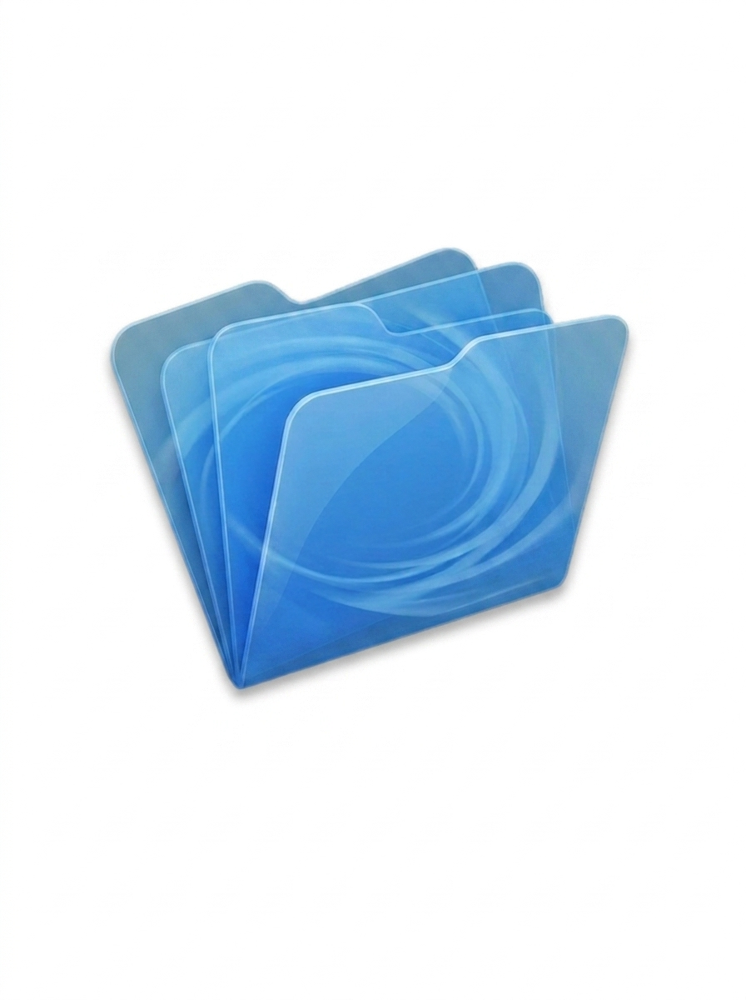

<div align="center">



# Shuffle

**A fast, keyboard-driven file manager for macOS.**

An open-source project with one goal: a genuinely better file explorer for macOS.
A modern alternative to Finder, Commander One, Path Finder, and ForkLift — built
to feel instant.

</div>

---

## Why Shuffle?

macOS file managers tend to be either too limited (Finder) or heavy and slow.
Shuffle takes the opposite approach, inspired by [File Pilot](https://filepilot.tech)
on Windows: a single, small, GPU-rendered native app that stays snappy no matter
how big the directory or how fast you move.

- **Instant.** GPU-rendered UI (Metal) with a fully virtualized file list — only
  the visible rows are ever built, so a folder with 100,000 items scrolls as
  smoothly as one with 10.
- **Keyboard-first.** A `Cmd+P` command palette with millisecond fuzzy search
  over your home directory, typo tolerance, and live path browsing.
- **Tabs & split view.** Work in multiple folders at once; drag a tab to the
  edge to split the window into two side-by-side panes.
- **Themable.** Dozens of built-in palettes (Catppuccin, Dracula, Nord, Gruvbox,
  Solarized, plus bold single-hue themes) and per-color customization.
- **Lightweight.** Ships as one small native `.app`. No Electron, no web view.

## Features

### Browsing
- 📂 **Familiar layout** — sidebar (Recent, Bookmarks, Applications, Pictures,
  Documents, Downloads, Macintosh HD, Home) and a sortable detail view.
- 🧭 **Smart breadcrumb path bar** — click any segment to jump there; the path
  you came from stays visible (grayed) so you can dive back with one click.
- ◀ ▶ **Back / forward** navigation, browser-style, per tab.
- ✏️ **Editable address bar** — click the empty part of the path bar to type,
  paste, or copy a path directly.
- 🖼️ **Real file icons & metadata** — genuine Finder icons, Kind
  ("Microsoft Excel", "DWG File", …), Date Modified, Size — with drag-to-resize
  columns. When a pane is too narrow, columns scroll horizontally instead of
  overflowing.
- 🖱️ **Double-click a file to open it** in its default app; single-click a folder
  to enter it.

### Tabs & split "canvas"
- ➕ **Tabs** — `Cmd+T` or the `+` button opens a new tab in the current folder.
  `Cmd+W` closes the active tab.
- 🔀 **Draggable tabs** — drag to reorder, with a live floating preview.
- 🪟 **Split view** — drag a tab to the right edge to split into two side-by-side
  panes, each with its own tabs, history, scroll, and filter. A draggable divider
  resizes them; closing a pane's last tab collapses the split.

### Find & search
- ⚡ **Command palette (`Cmd+P`)** — fuzzy-find any file or folder, copy/paste a
  directory to navigate, or run app commands (type `settings`), all in real time
  with typo tolerance (e.g. `dcouments` → `Documents`).
- 🔎 **In-directory filter (`/`)** — type `/` to filter the current folder by
  similarity, ranked, with the same typo tolerance.

### Customization
- 🎨 **Settings → Customization** (`Cmd+,`) — choose from preset palettes
  (Catppuccin Mocha/Macchiato/Frappé/Latte, Dracula, Nord, Tokyo Night, Gruvbox,
  One Dark, Solarized, Monokai, Everforest, Rosé Pine, and bold Forest/Crimson/
  Ocean/Grape/Amber/Rose/Teal themes, plus several light themes) or fine-tune the
  background, text, and mouseover colors. Changes apply live and persist.

### Other
- 🗂️ **Right-click context menu** — Open, Reveal in Finder, Copy Path, Move to
  Trash, New Folder, New File.
- 💾 **Remembers where you were** — reopens in your last directory; tracks recents
  and bookmarks.

## Platform support

Shuffle is built for **macOS**.

- **Apple Silicon (M-series) is the primary target** and where it's tuned and
  tested — that's where the speed shines.
- It is a standard Cocoa/Metal app and should run on **any modern Mac**
  (macOS 12 Monterey or later). Intel Macs can build from source; the only hard
  requirement is a Metal-capable GPU (every supported Mac has one).

> Currently distributed as a build-from-source app. Universal/Intel release
> binaries may follow.

## Building from source

Shuffle is written in **Rust** using [GPUI](https://www.gpui.rs/) (the GPU UI
framework behind the Zed editor).

### Prerequisites

- [Rust](https://rustup.rs/) (stable toolchain)
- Xcode Command Line Tools
- The **Metal Toolchain** (GPUI compiles its shaders at build time):

  ```sh
  xcodebuild -downloadComponent MetalToolchain
  ```

### Build & run

```sh
# Clone
git clone <your-fork-url> shuffle
cd shuffle

# Quick run (debug)
cargo run

# Optimized build
cargo build --release

# Assemble a proper Shuffle.app bundle (signed, with icon)
./make_app.sh
open ./Shuffle.app
```

Running as a real `.app` bundle (rather than the bare binary) gives the process
normal OS scheduling priority and lets macOS remember granted folder/privacy
permissions across launches.

> **Code signing:** `make_app.sh` signs with a stable Apple Development identity
> (overridable via the `SHUFFLE_SIGN_ID` env var) so macOS remembers granted
> permissions across rebuilds. Without a signing identity it falls back to
> ad-hoc signing (permissions re-prompt each run).

## Keyboard shortcuts

| Shortcut      | Action                                |
| ------------- | ------------------------------------- |
| `Cmd+P`       | Command palette / fuzzy find          |
| `/`           | Filter the current directory          |
| `Cmd+T`       | New tab                               |
| `Cmd+W`       | Close tab                             |
| `Cmd+,`       | Open Settings                         |
| `Cmd+Q`       | Quit                                  |
| `↑` / `↓`     | Move selection in the palette         |
| `Enter`       | Open the selected item / path         |
| `Esc`         | Close palette / filter / cancel edit  |

## Tech stack

- **Rust** — single-binary, memory-safe core.
- **GPUI** — GPU-accelerated, Metal-backed UI with native drag-and-drop.
- **AppKit (via objc2)** — real system icons (`NSWorkspace`), Trash, etc.
- **jwalk + rayon** — parallel directory walking and fuzzy ranking for the
  in-memory search index.

## Status

Early but usable, under active development. Contributions, issues, and ideas are
welcome.

## License

Open source. See [LICENSE](LICENSE) (add your preferred license — MIT or
Apache-2.0 recommended).
